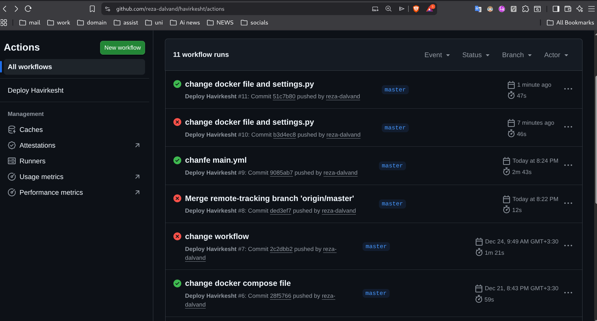
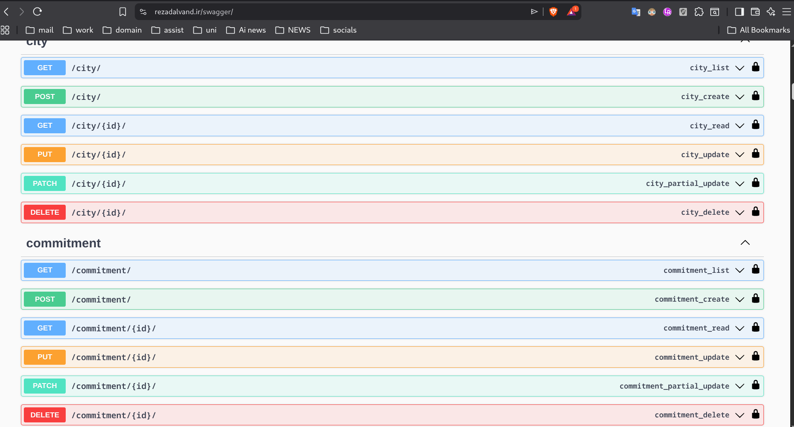
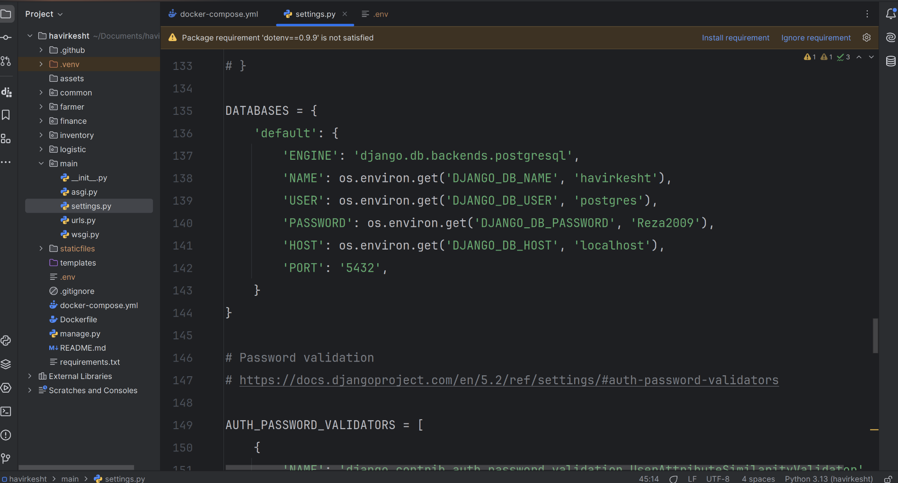
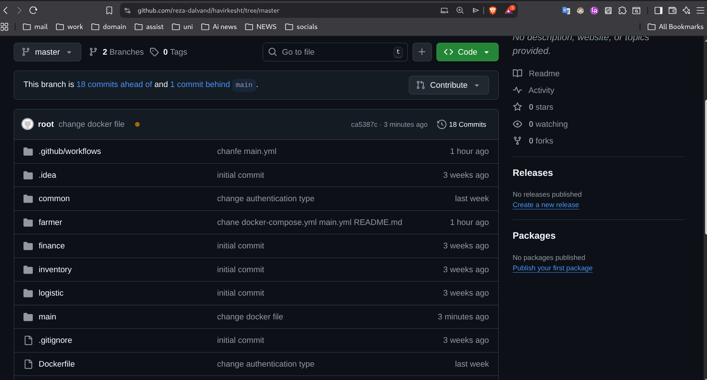
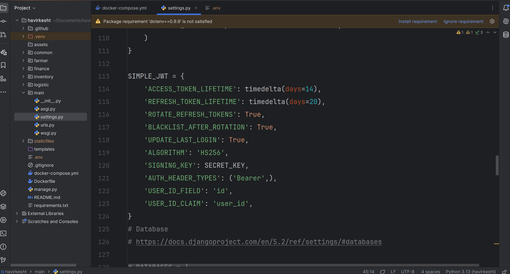
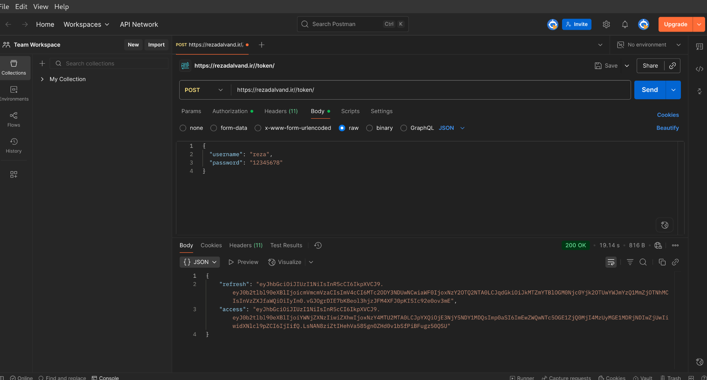

# havirkesht

### ci/cd

### Apis

### postgres database config

### Github repo

### Jwt config

### postman sample api

### server config

## (Commands)
`sudo docker compose up --build -d`

 # (comment test)